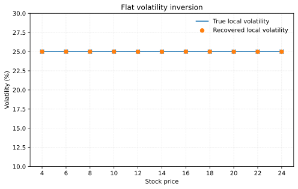
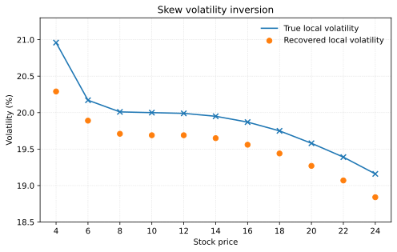
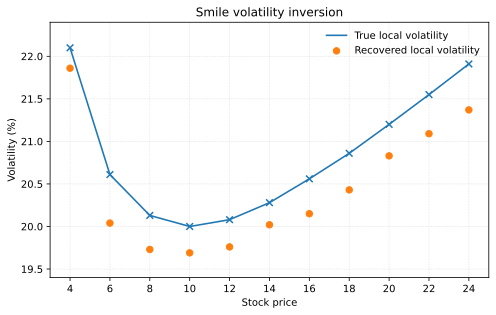
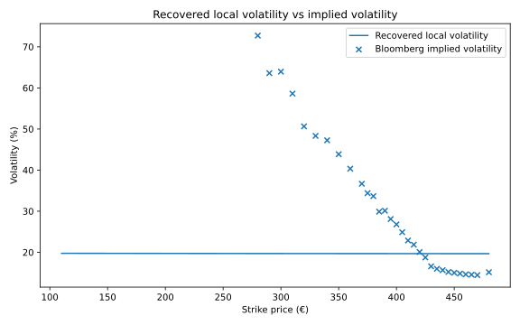
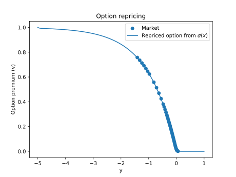

# Table of Contents

1.  [Project](#org65c5f77)
2.  [Theoretical background](#orge32a801)
3.  [Algorithm](#org2c5dfa8)
4.  [Simulated data inversion](#orgf54660b)
5.  [Real data inversion](#org98ecb57)
6.  [Appendix](#orgcd5ce3b)

# Project

This project reproduces major advancements in option pricing analytics, chiefly targeting the recovery of the implied local volatility for European options. This culminates in an inversion on real options data using a well-posed algorithm. The report also contains derivations for key mathematical results, and an in-depth technical explanation on the algorithm used. Full implementation in Python, using a wide range of NumPy tools.

This project includes:

1.  dense theoretical derivations for mathematical theory,
2.  analysis of Black-Scholes model solution,
3.  detailed explanation of well-posed algorithm,
4.  implementation of (Lishang, Jiang and Qihong, Chen and Ligun, Wang and Jin E., Zhang, 2003) algorithm in Python.

[Full report](Report/DissertationReport.pdf) available in /Report.   

# Theoretical background

The Black-Scholes equation underpins many industry standard methods of accurately pricing options. The parameters of the Black-Scholes equation for specific markets pose great value to practitioners. The Black-Scholes inverse problem concerns methods of effectively recovering these parameters from real markets. The Black-Scholes partial differential equation:

$$\frac{\partial u}{\partial t} + \frac{1}{2} \sigma^2 x^2 \frac{\partial^2 u}{\partial x^2} + (R-D) x \frac{\partial u}{\partial x} - Ru = 0; \quad R, D \geq 0, \; \sigma > 0,$$

with boundary conditions:

$$u(0,t) = 0, \quad t \in (0,T),$$

$$u(x,t )\sim xe^{-D(T-t)}, \quad x \rightarrow \infty,$$

and the initial market condition:

$$u(x, T) = \max \{x-K,0\}, \quad x \in (0,\infty],$$

where $u$ is the call option premium, $t$ is the current time, $\sigma$ is the underlying market volatility, $x$ is the price of an option, $R$ is the interest rate and $D$ is the dividend rate, sets the arbitrage-free price of an option in classical option pricing. Recovering &sigma; permits the arbitrage-free pricing and evaluation of existing options.

# Algorithm

The algorithm converts the Black-Scholes equation to an optimal control problem. First, we can numerically solve for the theoretical value of the option premium under an initial volatility estimate. Then, we solve an adjoint equation testing the goodness of fit between the theoretical and obtained curve. Finally, a variation inequality solver estimates the numerical value of the fit over a false interval, returning an improved estimate for volatility. These steps are repeated until convergence. [Project file](Programs/LishangAlg.py) available in /Programs/LishangAlg.py.

# Simulated data inversion

I simulated data according to the specifications: $D = 0$, $R = 0.12$, $a_0 = 0.005$, $a_1 = 0.045$, $\eta \leq 10^{-4}$, $x^* = 10$, $\tau^*=1$,

and the cases:

1.  'flat' volatility,
    $&sigma;p(x) = 0.25,$
2.  'smile' volatility,
    $&sigma;p(x) = (ln (s / 10))2 / 40 + 0.2,$
3.  'skew' volatility,
    $&sigma;p(x) = -(ln(s/10))3 / 80 + 0.2,$

For the optimal control problem, I set $L = M = 10$, $N = 0.01$, $\eta = 0.0001$, $\alpha = 0.45$, 5,000 loops within the variational inequality solver, and a maximum of 600 iterations for the overall function. The results showed a high degree of accuracy, and the inverted local volatility maintained the correct shape for the underlying volatility with a minor bias.

# Real data inversion

Using the Bloomberg Excel API, I got a wide range of strike prices for European call options on Allianz (ALV GY Equity), a major insurance company with a high volume of trading activity in European markets. After discarding repeated and far out of the money options, I obtained the local volatility. Repricing revealed a high degree of accuracy for in the money options.

# Appendix

Lishang, Jiang and Qihong, Chen and Ligun, Wang and Jin E., Zhang (2003). *A New Well-Posed Algorithm to Recover Implied Local Volatility*, {Quantitative Finance}.

